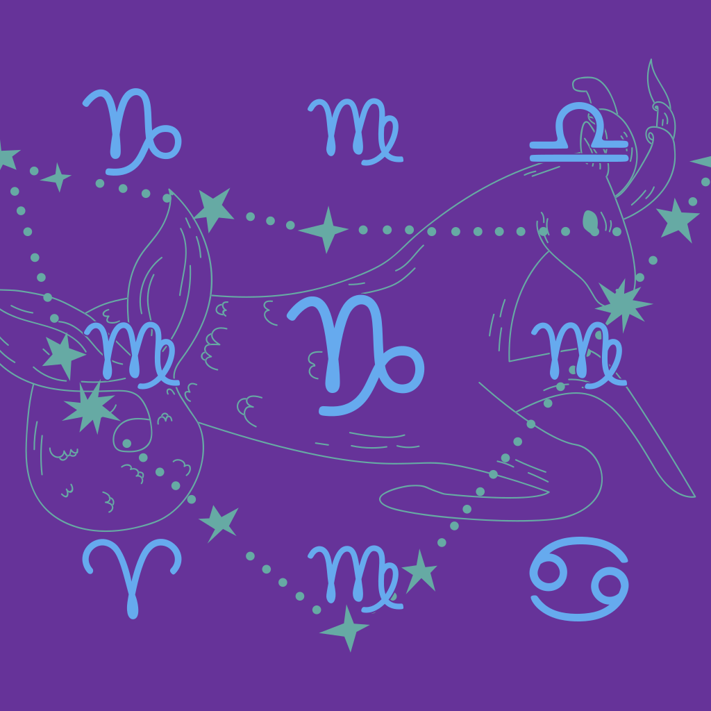

# Astral Identicons

Deterministic astrological SVG identicons built from an exact recoverable seed and six chart signs.

<p align="center">
  
</p>

## Packaged astral input

The web builder and CLI can open an `ASTRPKG4` `.astral` file without its password. They read only the authenticated public header:

```text
offset 60–91   exact raw 32-byte Ed25519 public key
offset 92–end  Solar, Lunar, Ascendant, Midheaven,
               Descendant and Imum Coeli signs
```

The file is not decrypted, rewritten or repackaged. The 32 key bytes are copied unchanged into the visual payload and used directly by the palette PRNG. They are never hashed, shortened or substituted with another seed.

The builder displays the key using its unique canonical 43-character unpadded base64url representation. Scanning the resulting identicon reconstructs the same 32 bytes and therefore reproduces that exact canonical public-key text.

Older `ASTRPKG1–3` files are not accepted for direct identicon ingestion because their public header does not use the version-4 raw-key contract. Repackage the original raw chart with Astral Packager 0.6.0 or later.

## Visual grammar

- **Solar layer:** upright constellation and artistic sign interpretation establish the Solar sign and orientation.
- **Centre grid:** nine upright glyphs repeat the six chart roles.
- **Astrological ring:** twelve rotated glyphs repeat the roles between two circles.
- **Palette:** one of 64 reduced three-colour palettes is selected from the exact seed material.
- **Glyph data:** twenty carriers contain the complete 40-byte systematic payload.
- **Parity stars:** 128 stars contain expanded Reed–Solomon parity used only for repair and disambiguation.

The stars are not the payload. Glyph carriers contain the data; stars provide redundant correction evidence.

## Visual-code version 6

The 40 systematic bytes keep their existing capacity and layout:

```text
byte 0       magic A5
byte 1       payload form
byte 2       seed length
bytes 3–34   exact seed material
bytes 35–37  six packed signs
bytes 38–39  CRC-16
```

Payload forms:

```text
1  exact UTF-8 text seed, 1–32 bytes
2  exact raw Ed25519 public key, always 32 bytes
```

A public-key payload fits without adding carriers or reducing error correction. The same twenty carriers still hold two bytes each. The existing 24 Reed–Solomon parity bytes can still repair up to 24 missing systematic bytes.

The parity is expanded into 128 star bytes. Each star encodes its byte through position, size and opacity. Fifty percent plus one observed star remains comfortably above the parity-recovery threshold.

## Browser builder

Choose **Packaged astral file** to fill the key and all six signs automatically. Manual seeds and signs remain supported.

```sh
bun run start
```

Open `http://127.0.0.1:4769`.

For LAN access:

```sh
HOST=0.0.0.0 PORT=4769 bun run start
```

The preview and downloaded SVG use the same `buildIdenticon()` renderer. File parsing, rendering and scanning remain local to the browser.

## CLI

From a packaged identity:

```sh
bun run identicon -- \
  --astral profile.astral \
  --out identicon.svg
```

Seed and sign overrides are rejected with `--astral`, so the output represents the file header unchanged.

Manual input remains available:

```sh
bun run identicon -- \
  --seed 62-70-F2-Example \
  --solar capricorn \
  --lunar virgo \
  --ascendant capricorn \
  --midheaven libra \
  --descendant cancer \
  --imum-coeli aries \
  --out identicon.svg
```

Without `--out`, SVG is written to standard output. JSON input remains available through `--json`.

## Scanner

The scanner accumulates useful glyph bytes, parity stars, colours and clear regions across frames. Shake, blur and temporary loss of the identicon do not erase progress. Once enough evidence exists, it freezes the reconstruction, stops the camera and completes parity repair and sign verification offline.

For payload form 2, scanner output is the canonical base64url display of the exact recovered 32-byte Ed25519 key.

## Palette

Text-seed palettes retain the existing deterministic rule and configured target nonces. Public-key palettes use the exact 32 key bytes with a deterministic SHA-256 counter-mode PRNG nonce. The base64url display text is not used as palette seed material.

Recalculate configured text-seed targets with:

```sh
bun run palette:tune
```

## GitHub Pages

Pushes to `main` build and deploy the static generator and scanner. Pull requests run type checks, tests and the Pages build without deploying.

```sh
bun run build:pages
```

Published page:

```text
https://kitty-crow.github.io/astral-identicons/
```

## Output

Every generated identicon is:

- a standalone 1024 × 1024 SVG;
- deterministic for the same exact input bytes, signs and assets;
- vector-only and self-contained;
- restricted to three reduced `#RGB` colours;
- equipped with recoverable seed material and six signs;
- protected by glyph data plus parity-only stars.

## Checks

```sh
bun run check
bun test
bun run build:pages
```
